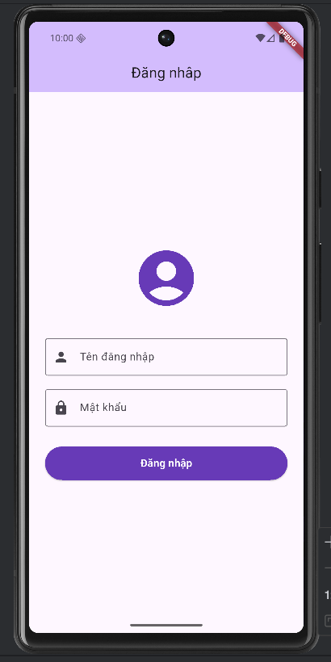

Mô tả bài Lab7

Link chứ video demo: https://drive.google.com/drive/folders/1dNvIhgargmmNVDfnjsxLm5k12QkjTmhS?usp=sharing

## 📝 Mô tả bài Lab7

Đây là ứng dụng Flutter cơ bản được xây dựng nhằm giúp sinh viên làm quen với quá trình phát triển ứng dụng di động bằng Flutter Framework và ngôn ngữ Dart.

Ứng dụng tập trung vào việc:
- Xây dựng giao diện bằng Widget
- Xử lý sự kiện người dùng
- Thiết kế giao diện theo Material Design
- Tổ chức bố cục màn hình trong Flutter

---

## 🚀 Công nghệ sử dụng

- Flutter Framework
- Dart Programming Language
- Android Studio
- Android Emulator (Pixel 6 API 36)

---

## 📂 Cấu trúc dự án

| Thư mục / File | Chức năng |
|---|---|
| `lib/main.dart` | File chính khởi chạy ứng dụng |
| `android/` | Cấu hình chạy Android |
| `test/` | Chứa file kiểm thử |
| `pubspec.yaml` | Quản lý thư viện và cấu hình Flutter |

---

## ✨ Chức năng chính

- Hiển thị giao diện Flutter cơ bản
- Sử dụng:
  - `Text`
  - `ElevatedButton`
  - `Column`
  - `Center`
  - `SizedBox`
  - `SingleChildScrollView`
  - `Scaffold`
- Tương tác người dùng thông qua nút bấm
- Cập nhật giao diện bằng `StatefulWidget`

---

## 📸 Hình ảnh ứng dụng

### Giao diện chạy trên Android Emulator

---

Chứa các file kiểm thử ứng dụng
pubspec.yaml
Khai báo thư viện và cấu hình dự án Flutter
